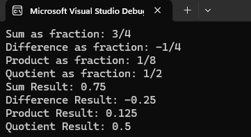
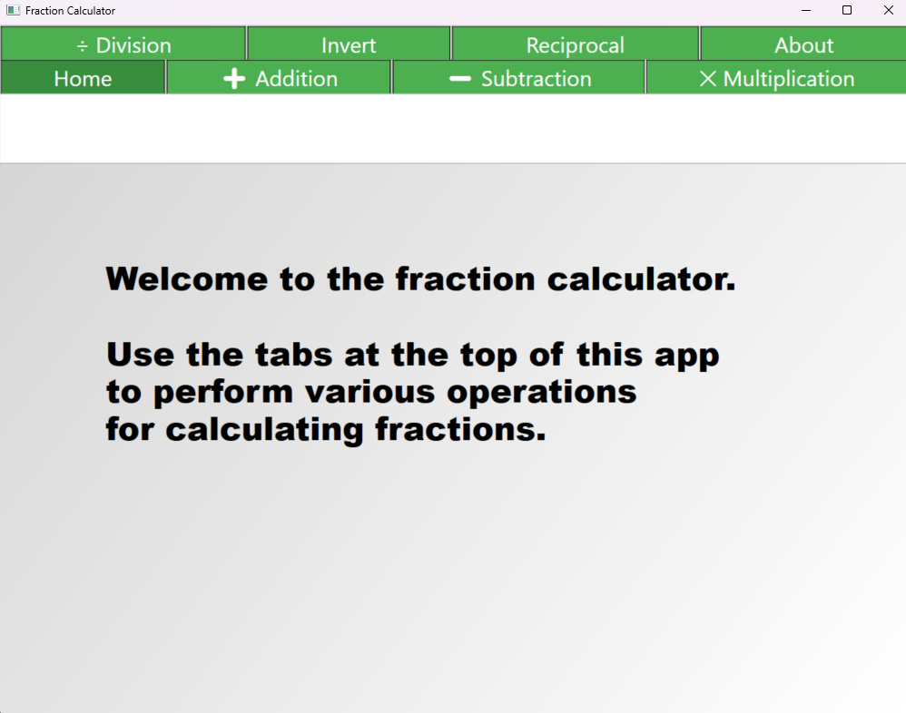
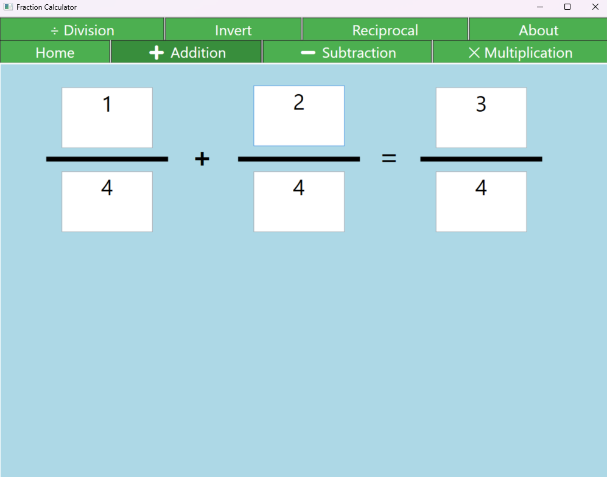
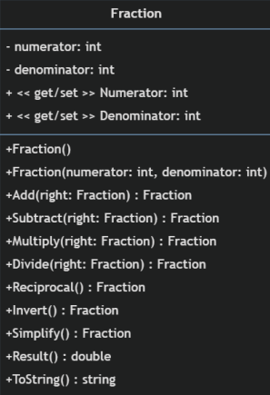

# Fraction Calculator

## Project Description
The Fraction Calculator is a simple application that allows users to perform basic arithmetic operations on fractions. It includes functionality for addition, subtraction, multiplication, and division of fractions, as well as finding inverses and reciprocals. The solution consists two projects (One WPF and the other is a console application). The main project is the WPF, the console application is to check if the library and all the functions work correct. In the WPF program you can easily use one of the operations to calculate fractions. Just fill in the textboxes and the result gets shown. You can't do this in the console app, however there are hardcoded fractions in this to check if the functions work correctly. 

## Author
Deklerck Andres

## Screenshots

This is a screenshot of the console application that shows that the library ( that I created ) works correctly.

This is a screenshot of the Home tab of the WPF App.

And this is a screenshot of the addition tab of the WPF App with two example fractions entered.

## Setup and Usage
To use the Fraction Calculator, you will need Visual Studio 2022. Simply clone the repository, open the solution in Visual Studio 2022 , and run the application.

## Unit Tests
Unit tests are included to ensure the correctness of the fraction arithmetic operations. The tests cover every operation in this project (addition, subtraction, multiplication, division, inverse, and reciprocal).
To run the unit tests, navigate to the test project in Visual Studio, and run all tests.

## UML Class Diagram of Fraction

## Future Improvements
- Improve user interface design for better usability and making it more user-friendly.
- Add support for mixed numbers and improper fractions.
